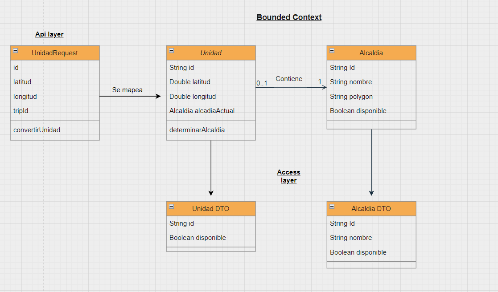
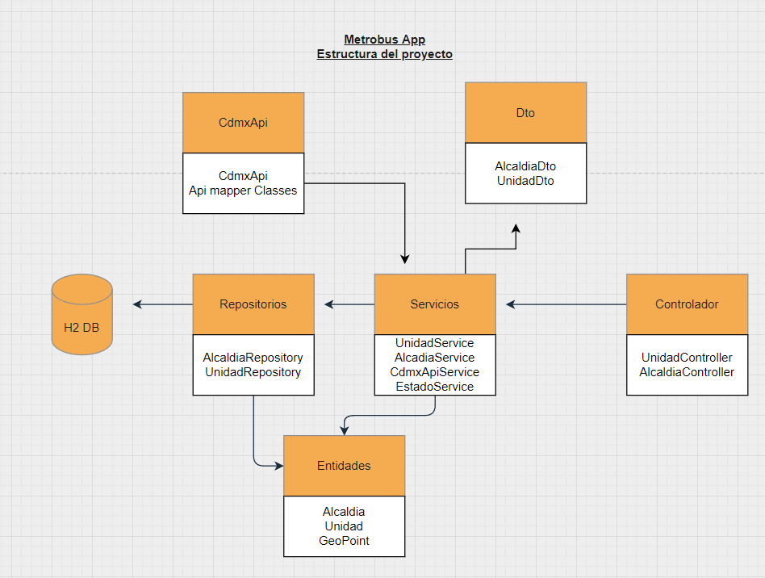

## Code documentation

Este proyecto de spring fue realizado por Jose Miguel Torrealba
el dia 2/16/2022

Este proyecto fue realizado como respuesta a un codechallenge de la empresa arkon en la ciudad de mexico el dia 14/2/2022 el enunciado del proyecto es el siguiente 

Descripción:
Desarrollar un pipeline de análisis de datos utilizando los datos abiertos de la Ciudad de México
correspondientes a las ubicaciones de las unidades del metrobús para que pueda ser
consultado mediante un API Rest filtrando por unidad o por alcaldía.
Requerimientos y reglas de negocio
● Presentar un diagrama con el diseño de su solución
● Obtener la alcaldía correspondiente a cada posición, el candidato tendrá la libertad de
elegir el método que consideré más adecuado.
● Almacenar la información en una base de datos
● Diseñar e implementar un API que permita consultar la información almacenada, con las
siguientes características:
 Obtener una lista de unidades disponibles
 Consultar la ubicación de una unidad dado su ID
 Obtener una lista de alcaldías disponibles
 Obtener la lista de unidades que se encuentren dentro de una alcaldía

NOTA IMPORTANTE: se tomo como que una unidad activa es aquella con un trip_id asignado, igualmente una alcaldia activa es aquella con unidades con un viaje asignado que esten en la alcaldia
igualmente se esta a la espera de feedback de si las condiciones no son las señaladas se modificara en una version posterior

## Actualizacion v1.2

1. Fix:Endpoint para ubicacion de unidades por id solo devolvia coordenadas y no alcaldia

    -Se agrego un DTO para mapear la alcadia y unidades 

2. Fix:Endpoint de unidades por alcaldia devuelve siempre las mismas unidades

    -Se arreglo por medio de agregar la anotacion @Pathvariable que falto para reconocer el id de la peticion

3. docs:Se arreglo la url para entrar al swagger en la documentacion

    - Aqui en la documentacion esta apuntada la url correcta para entra a [Swagger](http://localhost:8080/swagger-ui/index.html)
    - 
4. docs:Se retiro el endpoint de h2 de la documentacion

    - Al ser una base de datos que vive en el proceso de ejecucion el panel web no puede ser accedido desde cuando se corre la aplicacon desde docker, aunque funcione corriendo el proyecto normal de maven para evitar cualquier inconveniente se retiro su endpoint de la documentacion.   

## Tecnologias

las tecnologias seleccionadas para realizar el proyecto son:

- Suit de Spring v2.6
- In memory database H2
- Hibernate-spatial
   que implementa JTS para realizar las comprobaciones espaciales de puntos geofragicos y limites poligonales de alcaldias
- Docker.
- Swagger.

## Estandares implementados

- Javadoc
   Para la documentacion interna del codigo.
- Swagger
   Para la documentacion de controladores.
- Angular contributing team standar
   Para el control de versiones se implemento el standar del equipo de Angular [Git standar angular team](https://github.com/angular/angular/blob/22b96b9/CONTRIBUTING.md#-commit-message-guidelines)
- DDD o domain driven design se implemento pero al ser el contexto del problema bastante simple el context boundary y el ubiquitous language no tienen necesidad de ser explicados pero igualmente se anexaran diagramas de diseño con partes especificas de la solucion en codigo y no solo del contexto para aprovechar que ya se estan anexando

## Requisitos

Los requisitos minimos para correr el proyectos son los siguientes al ser un proyecto simple de spring con una base de datos en memoria sin embargo el proyecto sera empaquetado en una imagen de docker

- [JDK 1.8](http://www.oracle.com/technetwork/java/javase/downloads/jdk8-downloads-2133151.html)
- [Maven 3](https://maven.apache.org)
- [Docker](https://www.docker.com/)

## Sobre el proyecto

El proyecto funciona exponiendo dos rutas endpoint para realizar las peticiones exigidas en el challange, el backend por medio de un servicio chrono de estado cada x cantidad de tiempo(configurable en el servicio) realiza peticiones a la ciudad de mexico para conocer el estado de las unidades y alcaldias

Se trato de trabajar un codigo limpio siguiendo las mejores practicas y se tuvo en cuenta la funcionabilidad y escabilidad, por sobre el codigo muy complejo y breve de implementar lo que dio como resultado un proyecto que se considera junto a los comentarios que se dejaron facil de comprender

## Correr la aplicacion localmente

Para correr la aplicacion de forma local desde cualquier idle de java como Eclipse o Intellij
bastara con correr la aplicacion la clase DemoApplication.java en el directorio com/metrobuschallenge/DemoApplication.java

1. Si se desea correr de forma de imagen de docker se deben realizar se debe realizar un

   - ./mvnw clean install

que generara el jar del proyecto en target/spring-challenge.jar

2. En el directorio levantar la imagen de docker y correrla con:
   - docker build -t spring-challenge.jar .
   - docker run -p 8080:8080 spring-challenge.jar
## Diagrama de dominio

- Al ser el dominio bastante simple se aprovehco el diagrama para dar idea de partes que no estan dentro de los aggregates del bounded context.

## Estructura del proyecto

1. Controlador
   - Para manejar las peticiones rest que lleguen al sistemas.
2. Service
   - Para manejar la logica que sucede entre la llegada de la peticion y su interaccion con la BD.
3. Repository
   - Clase que interactua con la base de datos y sus peticiones.
4. Entity
   - Clases que son las representaciones de las tablas en la base de datos.
5. CdmxApi
   - capa logica que realiza peticiones a la ciudad de mexico para conocer el estado de las unidades.

## Peticiones

- Url base
 http://localhost:8080

- Se implemento swagger para generar la documentacion de las peticiones al crud luego de levantar el proyecto se puede solicitar la informacion detallada de los endpoint en la siguiente url.

   - /swagger-ui/index.html
   - ex: http://localhost:8080/swagger-ui/index.html

1. Alcaldias disponibles

   - url: GET /codechallenge/api/v1/alcaldias

   - Devuelve la lista de alcaldias por disponibilidad, por naturaleza de lo socilitado en el challenge devuelve las disponibles pero siguiendo el principio del patron de diseño SOLID - Open close, se dejo abierta la posibilidad en las clases de devolver el estado que se requiera no solo las disponibles.

2. Unidades disponibles
   - url: GET /codechallenge/api/v1/unidades/disponibles

   - Devuelve la lista de unidades por disponibilidad, por naturaleza de lo socilitado en el challenge devuelve las disponibles pero siguiendo el principio del patron de diseño SOLID - Open close, se dejo abierta la posibilidad en las clases de devolver el estado que se requiera no solo las disponibles.

3. Ubicacion de unidades
   - url: GET /codechallenge/api/v1/unidades/ubicacionporid/{id}

   - Devuelve las coordenadas de la ubicacion real de una unidad en estandar WTK del tipo POINT recibiendo su id por medio del parametro {id} señalado en la url anterior.

4. Unidades por alcaldia
   - url: GET /codechallenge/api/v1/unidades/poralcaldia/{alcaldia}

   - Devuelve una lista de unidades cuya ubicacion geografica se encuentre dentro del limite poligonal geografico de una alcaldia.
   - El parametro alcaldia se refiere al nombre de la alcadia y puede ser extraido de la siguiente lista:

- Alvaro Obregon
 - Azcapotzalco
  - Benito Juarez
  - Coyoaca
  - Cuajimalpa de Morelos
  - Cuauhtemoc
  - Gustavo A Madero
  - Iztacalco
  - Iztapalapa
  - La Magdalena Contreras
  - Miguel Hidalgo
  - Milpa Alta
  - Tlahuac
  - Tlalpan
  - Venustiano Carranza
  - Xochimilco
  

